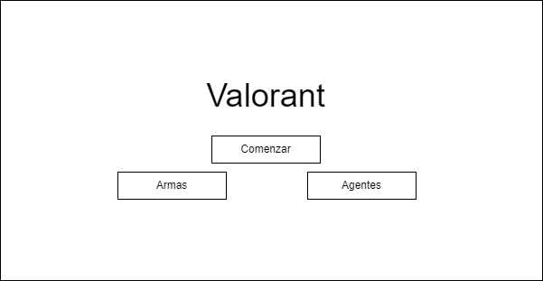
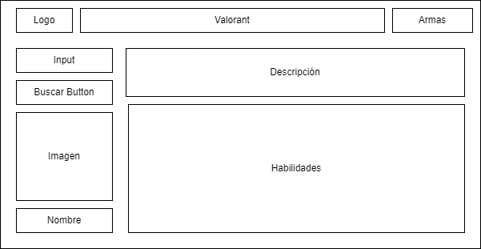
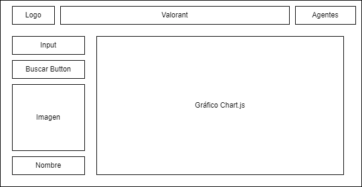

# Proyceto 3: Dashboard y API's
Proyecto hecho y diseñado por los programadores **Sebastián Aguilera** y **Araceli Deij** para la evaluación numero tres del Bootcamp UDD, **consumo de una API**.

En la aplicación utilizamos la API (Valorant) para obtener datos de los elementos del videojuego Valorant, tales como, las armas y los agentes, cada arma posee sus propiedades unicas con sus propias metricas.

Para obtener la información utilizamos axios, axios nos permite realizar peticiones a la API de manera sencilla y con pocas líneas de código y utilizando Try / Catch podemos gestionar los errores y tomar acción en respuesta a estos.

Finalmente utilizando Chart.js, graficámos automaticamente los datos que necesitamos en el momento que se solicitan de la API, de esta forma el Cliente podrá ver a tiempo real los datos pertinentes de las armas del juego que desee en un grafico que se genera dinámicamente.

#### Tecnologías utilizadas en el proyecto

- API (https://dash.valorant-api.com/);
- CSS5 (FlexBox);
- Git (2 participantes);
- HTML5;
- JavaScript
- Axios
- Chart.js

#### Rutas

    index.html/
            agentes.html/
            armas.html/
			

#### WireFrames

#### Link a la página

https://aracelidc.github.io/Proyecto-3-Dashboard/
